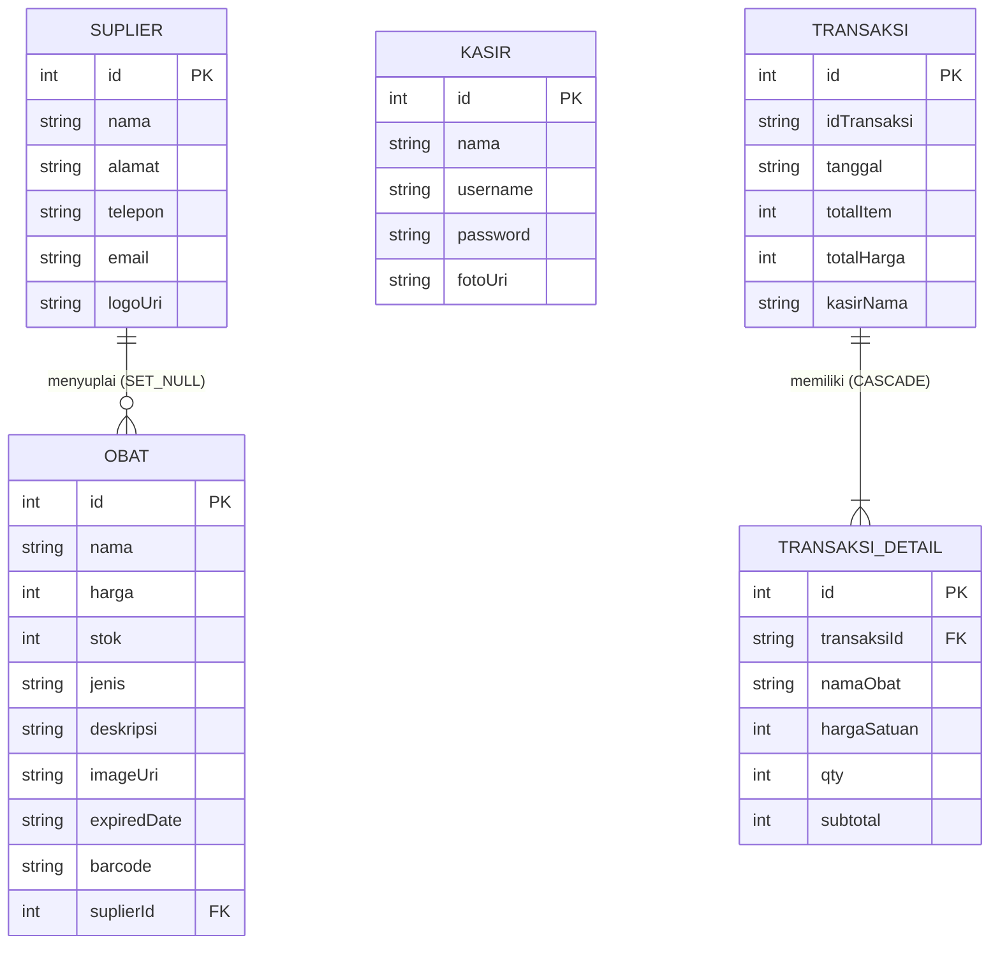
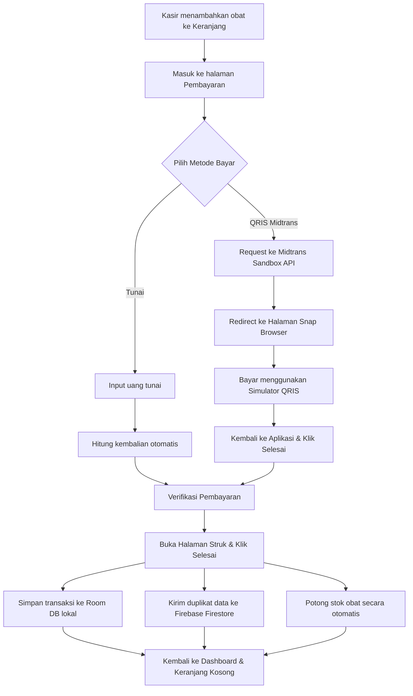

# PharmaTic 🏥
### Aplikasi Manajemen Apotek & Kasir Mobile Pintar

[](https://kotlinlang.org)
[](https://developer.android.com)
[](https://developer.android.com/training/data-storage/room)
[](https://firebase.google.com)
[](https://midtrans.com)
[](https://developer.android.com/topic/libraries/architecture)

---

## 📌 Deskripsi Proyek
**PharmaTic** adalah aplikasi Android yang dirancang untuk mempermudah operasional apotek. Aplikasi ini membantu pemilik apotek dan kasir mengelola stok obat, data suplier, akun kasir, hingga transaksi penjualan harian agar lebih rapi dan teratur.

Aplikasi ini dibuat dengan konsep *offline-first*. Artinya, semua data transaksi dan stok disimpan dulu di penyimpanan lokal menggunakan **Room Database** agar aplikasi tetap cepat dan tidak bergantung pada internet. Untuk cadangan data, transaksi akan otomatis disinkronkan ke **Firebase Firestore** saat online. Selain itu, kasir juga bisa menerima pembayaran digital (QRIS) karena aplikasi ini sudah terhubung dengan **Midtrans Sandbox**.

Aplikasi ini dikembangkan sebagai bagian dari tugas besar mata kuliah pemrograman mobile (**Tubes Mobile - Semester 6**).

---

## 🚀 Fitur Utama

Aplikasi PharmaTic menggunakan sistem hak akses ganda (multi-role) yang membagi fungsionalitas aplikasi menjadi dua peran utama:

### 1. Panel Admin (Admin Dashboard)
Halaman ini digunakan oleh pemilik atau pengelola apotek (login default: `admin`/`admin`) untuk mengontrol semua data utama:
*   📦 **Kelola Data Obat (CRUD)**: Bisa tambah, edit, cari, dan hapus data obat (nama, stok, harga, jenis, deskripsi, foto, tanggal kedaluwarsa, dan barcode).
*   👥 **Kelola Akun Kasir (CRUD)**: Mendaftarkan akun kasir baru, memperbarui profil, atau menghapus kasir. Password kasir otomatis dienkripsi dengan SHA-256 agar aman.
*   🏢 **Kelola Suplier (CRUD)**: Menyimpan data kontak dan alamat suplier yang menyuplai obat ke apotek.
*   📈 **Laporan Penjualan**: 
    *   Melihat total omzet dan jumlah transaksi secara real-time.
    *   Melihat daftar detail dari setiap transaksi yang terjadi.
    *   **Bagikan Rangkuman**: Mengirim ringkasan penjualan dalam format teks ke WhatsApp, Telegram, atau Email.
*   🚨 **Notifikasi Stok Obat**: Muncul peringatan di dashboard jika ada obat yang stoknya sisa 10 atau kurang, agar admin bisa langsung tahu obat apa saja yang harus dipesan lagi.

### 2. Panel Kasir (Cashier Dashboard)
Halaman operasional untuk staf kasir saat melayani pembeli:
*   🔎 **Cek Stok & Cari Obat**: Kasir bisa mencari obat dengan cepat dan melihat sisa stok yang tersedia secara langsung.
*   🛒 **Keranjang Belanja**: Memasukkan obat ke keranjang, menambah/mengurangi jumlah barang, dan menghitung total belanjaan secara otomatis.
*   💳 **Dua Metode Pembayaran**:
    *   **Tunai**: Kasir menginput nominal uang dari pembeli, dan aplikasi otomatis menghitung kembaliannya.
    *   **QRIS (Midtrans Sandbox)**: Membuat transaksi QRIS menggunakan Midtrans Snap API. Aplikasi akan membuka halaman pembayaran di browser untuk simulasi pembayaran, setelah itu kasir cukup menekan tombol selesai di aplikasi.
*   🧾 **Struk Belanja**: Menampilkan struk transaksi (nama obat, kuantitas, harga, total belanja, nominal bayar, kembalian, tanggal) lengkap dengan ucapan lekas sembuh untuk pelanggan.
*   📋 **Riwayat Transaksi**: Kasir bisa melihat daftar transaksi apa saja yang sudah mereka proses sebelumnya.

---

## 🛠️ Stack Teknologi & Pustaka

Aplikasi ini dibangun menggunakan teknologi native Android dengan struktur yang teratur:
*   **Bahasa Pemrograman**: Kotlin (versi 1.9.0+).
*   **Arsitektur (MVVM & Repository Pattern)**: Memisahkan tampilan aplikasi (UI) dengan logika data agar kode lebih rapi, terstruktur, dan mudah dikembangkan di kemudian hari.
*   **Database Lokal (Room Database)**: Menyimpan data obat, kasir, suplier, dan transaksi langsung di memori HP agar aplikasi bisa diakses dengan cepat tanpa lag.
*   **Penyimpanan Cloud (Firebase Firestore)**: Mencadangkan data transaksi dari database lokal ke cloud secara real-time sebagai backup data penjualan.
*   **Koneksi Internet (Retrofit 2 & OkHttp 3)**: Digunakan untuk berkomunikasi dengan API Midtrans saat memproses pembayaran QRIS.
*   **Pemuatan Gambar (Glide)**: Menampilkan foto obat dengan cepat dan menghemat kuota lewat fitur penyimpanan sementara (*caching*).
*   **Proses Latar Belakang (Coroutines & LiveData)**: Menangani proses berat (seperti membaca data) di latar belakang agar aplikasi tidak macet, sekaligus memperbarui tampilan layar secara otomatis jika ada perubahan data.
*   **Keamanan Data**: Mengenkripsi password kasir menggunakan hashing SHA-256 sebelum disimpan ke database.

---

## 📊 Desain Database (Room DB)

Data di dalam aplikasi ini disimpan menggunakan beberapa tabel yang saling terhubung (menggunakan *Foreign Key*) untuk memastikan data tetap konsisten dan tidak bentrok:



---

## 📂 Struktur Proyek (Struktur Paket Kotlin)

```text
com.example.pharmatic
│
├── PharmaTicApp.kt                # Kelas Application utama (Inisialisasi DB & Seed Data)
├── DashboardActivity.kt           # Dashboard Kasir
│
├── admin
│   ├── AdminDashboardActivity.kt  # Dashboard Admin (Kelola Fitur, Notifikasi Stok)
│   └── LaporanActivity.kt         # Laporan Penjualan (Statistik, Share/Cetak Laporan)
│
├── api
│   ├── RetrofitClient.kt          # Konfigurasi Retrofit untuk Midtrans Sandbox
│   ├── MidtransApi.kt             # Endpoint API Midtrans
│   ├── MidtransRequest.kt         # Model Data Request (Snap token)
│   └── MidtransResponse.kt        # Model Data Response (Snap redirect URL)
│
├── auth
│   ├── LoginActivity.kt           # Autentikasi Pengguna & Multi-role router
│   └── SplashActivity.kt          # Splash Screen awal
│
├── data
│   ├── DataManager.kt             # Penyemaian data awal (Seed Database untuk Obat, Kasir, Suplier)
│   ├── SessionManager.kt          # Helper Session menggunakan SharedPreferences
│   ├── dao
│   │   ├── KasirDao.kt
│   │   ├── ObatDao.kt
│   │   ├── SuplierDao.kt
│   │   ├── TransaksiDao.kt
│   │   └── TransaksiDetailDao.kt
│   ├── database
│   │   └── PharmaTicDatabase.kt   # Definisi Room Database (Migrasi destruktif otomatis)
│   └── repository
│       └── PharmaTicRepository.kt # Sumber data tunggal yang menjembatani DAO
│
├── history
│   ├── HistoryActivity.kt         # Daftar Riwayat Penjualan
│   ├── DetailHistoryActivity.kt   # Rincian Transaksi
│   ├── HistoryAdapter.kt
│   └── DetailHistoryAdapter.kt
│
├── kasir
│   ├── KelolaKasirActivity.kt     # Halaman CRUD Kasir (Admin)
│   ├── TambahKasirActivity.kt     # Form tambah kasir
│   ├── EditKasirActivity.kt       # Form ubah data kasir
│   └── KasirAdapter.kt
│
├── keranjang
│   ├── KeranjangActivity.kt       # Halaman List belanjaan kasir
│   ├── KeranjangAdapter.kt
│   └── KeranjangManager.kt        # Singleton Cart untuk menyimpan item belanja sementara
│
├── model
│   ├── Kasir.kt                   # Entitas Kasir (SHA-256 Hashing)
│   ├── Obat.kt                    # Entitas Obat (Relasi Suplier)
│   ├── Suplier.kt                 # Entitas Suplier
│   ├── Transaksi.kt               # Entitas Transaksi
│   └── TransaksiDetail.kt         # Entitas Rincian Transaksi (Relasi Transaksi)
│
├── obat
│   ├── ObatActivity.kt            # Pencarian Obat oleh Kasir
│   ├── KelolaObatActivity.kt      # Halaman CRUD Obat (Admin)
│   ├── TambahObatActivity.kt      # Form tambah obat
│   ├── EditObatActivity.kt        # Form ubah data obat
│   ├── ObatAdapter.kt
│   └── KelolaObatAdapter.kt
│
├── pembayaran
│   ├── PembayaranActivity.kt      # Pilihan Pembayaran (Tunai / Midtrans QRIS)
│   └── VerifikasiPembayaranActivity.kt # Konfirmasi total bayar & uang kembalian
│
├── struk
│   └── StrukActivity.kt           # Cetak Struk, sinkronisasi Room & Firestore, pemotongan stok
│
├── suplier
│   ├── KelolaSuplierActivity.kt   # Halaman CRUD Suplier (Admin)
│   ├── TambahSuplierActivity.kt   # Form tambah suplier
│   ├── EditSuplierActivity.kt     # Form ubah data suplier
│   └── SuplierAdapter.kt
│
└── viewmodel
    ├── KasirViewModel.kt
    ├── ObatViewModel.kt
    ├── SuplierViewModel.kt
    └── TransaksiViewModel.kt
```

---

## ⚙️ Langkah Pemasangan & Pengujian

Ikuti langkah-langkah di bawah ini untuk menjalankan proyek PharmaTic di komputer atau HP Anda:

### 1. Kebutuhan Sistem
*   **Android Studio** (Disarankan versi Koala atau yang lebih baru).
*   **JDK 17** yang sudah dikonfigurasi pada setelan Android Studio.
*   **Android SDK**: Minimum SDK 24 (Android 7.0) dan Target SDK 36.
*   Koneksi internet aktif untuk menghubungkan Firebase dan memproses pembayaran Midtrans.

### 2. Konfigurasi Midtrans Key (`local.properties`)
Untuk keperluan simulasi pembayaran, aplikasi memerlukan server key dari Midtrans. Demi keamanan, key ini disimpan secara lokal:
1. Buka file `local.properties` yang ada di folder utama proyek.
2. Masukkan baris konfigurasi di bawah ini (sudah disediakan server key sandbox default):
   ```properties
   MIDTRANS_API_KEY=TWlkLXNlcnZlci15UUdocWR6MF85OUhuU1BlTVIyM1hGbVU6
   ```

### 3. Konfigurasi Database Firebase
Aplikasi ini sudah dilengkapi dengan file `google-services.json` default. Jika Anda ingin menyambungkannya ke database Firebase pribadi:
1. Buat proyek baru di [Firebase Console](https://console.firebase.google.com/).
2. Unduh file konfigurasi `google-services.json` dari dashboard proyek Firebase Anda.
3. Letakkan file tersebut di dalam folder `/app/` pada proyek ini.
4. Aktifkan menu Cloud Firestore di Firebase Console dan atur aturan keamanan (*rules*) ke mode pengembangan (*read, write: true*) untuk mempermudah uji coba.

### 4. Menjalankan Aplikasi
1. Buka folder proyek ini menggunakan **Android Studio**.
2. Tunggu hingga proses sinkronisasi Gradle (*sync*) selesai berjalan.
3. Sambungkan HP Android Anda via kabel data (pastikan USB Debugging aktif) atau gunakan Emulator bawaan Android Studio.
4. Klik tombol **Run (ikon play / Shift + F10)** untuk menjalankan aplikasi.

---

## 🔑 Data Akun untuk Uji Coba (Login)

Saat pertama kali dibuka, aplikasi akan otomatis mengisi data awal (*database seeding*) ke database lokal. Anda bisa langsung mencoba login menggunakan akun-akun contoh di bawah ini:

| Peran | Username | Password | Keterangan |
|---|---|---|---|
| **Admin** | `admin` | `admin` | Masuk ke dashboard administrator |
| **Kasir** | `kasir` | `1234` | Masuk ke dashboard kasir (Nama: Ardy) |
| **Kasir** | `budi_kasir` | `1234` | Masuk ke dashboard kasir (Nama: Budi) |
| **Kasir** | `siti22` | `1234` | Masuk ke dashboard kasir (Nama: Siti Aminah) |

---

## 🛡️ Diagram Alur Transaksi (Room + Firebase + Midtrans)

Berikut adalah bagan sederhana yang menjelaskan jalannya transaksi, mulai dari kasir memilih obat, proses pembayaran, hingga penyimpanan data ke database lokal dan cloud:



---

## 👥 Tim Pengembang (Kelompok 3)
Aplikasi ini dirancang dan dibangun bersama oleh anggota Kelompok 3:
1. **Developer 1** (Fokus pada database lokal Room & bagian logika backend)
2. **Developer 2** (Fokus pada integrasi database Firebase & gerbang pembayaran Midtrans)
3. **Developer 3** (Fokus pada pembuatan desain UI/UX, tata letak XML, dan tema aplikasi)

---
*Semoga aplikasi ini dapat mempermudah operasional apotek Anda. Lekas sembuh bagi seluruh pelanggan!* 🏥💚